<p align="center">
  
  
  
  
  
</p>

<h1 align="center">DIY Fingerprint-Based Mac Unlocker</h1>

<p align="center">
  <strong>Touch your finger. Mac unlocks. That's it.</strong>
  <br>
  A hardware fingerprint authenticator that types your password via USB HID — no drivers, no software, no cloud.
</p>

<p align="center">
  <a href="#how-it-works">How It Works</a> &bull;
  <a href="#hardware">Hardware</a> &bull;
  <a href="#getting-started">Getting Started</a> &bull;
  <a href="#architecture">Architecture</a> &bull;
  <a href="#security">Security</a> &bull;
  <a href="USAGE.md">Usage Guide</a>
</p>

---

> **Device built and flashed?** See the [Usage Guide](USAGE.md) for first use, daily operation, the Web Serial Monitor, LED reference, and troubleshooting during use.

---

## How It Works

The device acts as a USB keyboard. When it recognizes your fingerprint, it sends the exact keystrokes to lock your Mac, wake the login screen, and type your password — all in under 7 seconds.


> **Why LEFT_CTRL for wake?** It's a non-printable modifier key — wakes the display without typing any character into the password field. Space or regular keys would insert unwanted text.

---

## Hardware

| Component | Model | Role |
|-----------|-------|------|
| **MCU** | [Waveshare RP2350-Zero](https://www.waveshare.com/rp2350-zero.htm) | USB-C, RP2350A dual-core, 4MB flash |
| **Sensor** | [DFRobot SEN0348](https://wiki.dfrobot.com/Capacitive_Fingerprint_Sensor_SKU_SEN0348) | Capacitive fingerprint, UART, 80-slot storage |
| **Switch** | Any SPDT toggle | Selects REGISTER vs RECOGNIZE mode |

### Why These Parts?

The **RP2350-Zero** was chosen for its native USB HID support via the Pico SDK — it appears as a standard keyboard to any OS with zero driver installation. The **SEN0348** is a standalone capacitive sensor with onboard processing and an RGB LED ring, so the MCU just sends UART commands and the sensor handles all biometric computation internally.

---

## Wiring

```
  DFRobot SEN0348                          RP2350-Zero
  ───────────────────────────────────────────────────────
  Green  (VCC)    ──→  3V3 pin
  White  (VIN)    ──→  3V3 pin (same rail)
  Red    (GND)    ──→  GND pin
  Yellow (TX out) ──→  GPIO1 (UART0 RX on the board)
  Black  (RX in)  ──→  GPIO0 (UART0 TX on the board)
  Blue   (IRQ)    ──→  GPIO2 (interrupt-driven finger detection)

  SPDT Switch     ──→  GPIO3 (other leg to GND)
                       LOW = REGISTER
                       HIGH = RECOGNIZE (internal pull-up)
```

### Pin Map

| GPIO | Function | SEN0348 Wire |
|------|----------|-------------|
| `0` | UART0 TX → Sensor RX | Black |
| `1` | UART0 RX ← Sensor TX | Yellow |
| `2` | IRQ — finger touch interrupt | Blue |
| `3` | SPDT Switch | — |
| `3V3` | Sensor VCC + VIN | Green + White |
| `GND` | Sensor GND + Switch | Red |

---

## Getting Started

### Prerequisites

- [Arduino IDE](https://www.arduino.cc/en/software) 1.8+ or 2.x
- [arduino-pico](https://github.com/earlephilhower/arduino-pico) core v5.5.0+ (Earle Philhower)
- [DFRobot_ID809](https://github.com/dattasaurabh82/DFRobot_ID809) library (_Mine is a fork of the original with some patches [explained in this PR](https://github.com/DFRobot/DFRobot_ID809/pull/7)_)

### Board Setup

1. **Arduino IDE** → **Tools** → **Board Manager** → Search `rp2040` → Install **Raspberry Pi Pico/RP2040/RP2350** by Earle F. Philhower
2. **Tools** → **Board** → `Waveshare RP2350 Zero`
3. **Tools** → **USB Stack** → `Pico SDK (TinyUSB)`
4. _All other SETTINGS stays at DEFAULT_

### Install the Sensor Library

**Sketch** → **Include Library** → **Manage Libraries** → Search `DFRobot_ID809` → Install

### Flash

1. Clone or download this repo
2. Open `diy_fingerprint_based_unlocker.ino` in Arduino IDE
3. Connect the RP2350-Zero via USB-C
4. **Upload**

> **Note**: After upload, the USB port may re-enumerate (CDC+HID composite device). Re-select the port in **Tools → Port** if Serial Monitor doesn't connect.

---

## Configuration

All tunables live in [`config.h`](config.h):

| Constant | Default | Description |
|----------|---------|-------------|
| `COLLECT_COUNT` | 3 | Fingerprint captures per enrollment |
| `CAPTURE_TIMEOUT` | 10s | Per-capture timeout |
| `MATCH_TIMEOUT` | 5s | Recognition capture timeout |
| `PASSWORD_MAX_LEN` | 32 | Maximum password length |
| `PASSWORD_TIMEOUT_MS` | 30000 | Password entry timeout (ms) |
| `LOCK_DELAY_MS` | 2000 | Wait after Ctrl+Cmd+Q |
| `WAKE_SETTLE_MS` | 2000 | Wait after wake keypress |
| `COOLDOWN_MS` | 5000 | Ignore touches after unlock |
| `DEBOUNCE_MS` | 50 | Switch debounce window |

---

## Architecture

### State Machine


### Module Structure

```
diy_fingerprint_based_unlocker/
├── diy_fingerprint_based_unlocker.ino   # Main: setup(), loop(), state machine
├── config.h                             # Pin map, timing constants, EEPROM layout
├── switch_control.h                     # Debounced SPDT switch with change detection
├── led_feedback.h                       # Semantic LED ring wrappers
├── irq_finger.h                         # IRQ-based finger detection (GPIO2 interrupt)
├── tiny_aes.h                           # Self-contained AES-256-CBC implementation
├── crypto.h                             # Device-bound key derivation + encrypt/decrypt
├── eeprom_storage.h                     # Encrypted EEPROM read/write/verify
├── registration.h                       # Two-slot safe fingerprint + password enrollment
├── recognition.h                        # Fingerprint match → HID unlock sequence
├── hid_unlock.h                         # Mac-specific HID keystroke sequence
├── validation.h                         # Boot integrity check + orphan cleanup
├── web/
│   ├── index.html                       # Web Serial Monitor — HTML shell
│   ├── style.css                        # Nord dark theme + layout styles
│   └── app.js                           # Web Serial API + xterm.js logic
├── .github/workflows/
│   └── deploy-pages.yml                 # GitHub Actions → GitHub Pages deployment
├── USAGE.md                             # User guide (first use, web monitor, LED, troubleshooting)
├── PLAN.md                              # Full architecture document
├── CONTEXT.md                           # Compressed build knowledge
└── tests/
    ├── 1_queryDeviceBPS/                # UART baud rate test
    ├── 2_queryDeviceFullInfo/           # Sensor capability query
    ├── 3_ledRingTest/                   # LED color/mode test
    ├── 4_fingerTouchDetection/          # Touch detection polling
    ├── 5_fingerPrintEnrollment/         # Enrollment flow test
    ├── 6_fingerPrintSearchMatch/        # Match/search test
    ├── 7_hidTest/                       # Basic HID keystroke test
    └── 8_hidModifierTest/              # Modifier combo + Serial coexistence
```

All modules are **header-only** (`.h` with `inline` functions) — no separate `.cpp` files. This keeps the Arduino IDE happy with a flat sketch structure.

### Two-Slot Alternating Registration

The sensor has 80 fingerprint slots. We use exactly **two** (slot 1 and slot 2) in an alternating pattern to ensure atomic registration safety:

```mermaid
flowchart TD
    A[Start Registration] --> B{Current active slot?}
    B -->|Slot 1| C[Enroll NEW fingerprint → Slot 2]
    B -->|Slot 2| D[Enroll NEW fingerprint → Slot 1]
    B -->|Virgin| E[Enroll → Slot 1]
    C --> F[Collect password via Serial]
    D --> F
    E --> F
    F --> G[Confirm password]
    G --> H[Write EEPROM: magic + slot + password + checksum]
    H --> I{EEPROM verify OK?}
    I -->|Yes| J[Delete OLD slot — safe now]
    I -->|No| K[Rollback: delete staging slot, restore old EEPROM]
    J --> L[Done — new slot is active]
    K --> M[Old registration still works]

    style J fill:#2d6a4f,color:#fff
    style K fill:#9b2226,color:#fff
    style L fill:#2d6a4f,color:#fff
    style M fill:#9b2226,color:#fff
```



**Why?** If we deleted the old fingerprint first and something fails mid-registration (timeout, bad password, power loss), the old fingerprint is gone forever — the sensor doesn't expose raw templates for backup. By enrolling to the *other* slot first, the old registration stays intact until the entire atomic commit succeeds.

### EEPROM Layout

```
Address  Size   Contents
──────────────────────────────────────
0x00     1      Magic byte (0xAE = encrypted format)
0x01     1      Active slot ID (1 or 2)
0x02     1      Password length (1–32, plaintext)
0x03     32     Password (AES-256-CBC encrypted)
0x23     1      XOR checksum (bytes 0x00–0x22)
──────────────────────────────────────
Total: 36 bytes of 4096 available
```

The password is encrypted at rest using a device-bound key derived from the RP2350's unique hardware ID. The checksum validates the encrypted data's integrity before decryption is attempted.

### Boot Validation Matrix

| EEPROM | Sensor | Result | Action |
|--------|--------|--------|--------|
| Valid + checksum OK | Active slot has fingerprint | **VALID** | Normal operation, clean orphan staging slot |
| Invalid / missing | No fingerprints | **VIRGIN** | Force REGISTER mode |
| Valid | Active slot fingerprint **missing** | **CORRUPT** | Clear all, force REGISTER |
| Invalid | Fingerprint(s) exist | **CORRUPT** | Delete orphans, force REGISTER |

---

## Serial Protocol

All serial output uses structured `[TAG] message` format, parsed by the [Web Serial Monitor](https://dattasaurabh82.github.io/diy_fingerprint_based_unlocker/):

```
[BOOT]    Startup and validation messages
[SWITCH]  Mode switch changes
[MODE]    Current operating mode
[REG]     Registration flow
[AUTH]    Recognition / authentication
[HID]     HID keystroke actions
[CMD]     Serial command acknowledgements (e.g. !RESET)
[WARNING] Non-fatal issues
[ERROR]   Fatal errors (halts device)
```

<details>
<summary><strong>Example: Full Registration + Unlock Session</strong></summary>

```
========================================
[BOOT] Fingerprint Unlocker v1.0.0
========================================
[BOOT] Serial OK
[BOOT] Switch: RECOGNIZE
[BOOT] Sensor init... OK
[BOOT] Enrolled fingerprints: 1
[MODE] RECOGNIZE
[BOOT] Ready
----------------------------------------
[SWITCH] REGISTER
[SENSOR] Finger detected — starting registration
[MODE] REGISTER
[REG] Active slot: 1, staging to slot: 2
[REG] Cleaned staging slot 2
[REG] Place finger (1/3)...
[REG] Captured 1/3
[REG] Remove finger...
[REG] Place finger (2/3)...
[REG] Captured 2/3
[REG] Remove finger...
[REG] Place finger (3/3)...
[REG] Captured 3/3
[REG] Remove finger...
[REG] Storing to staging slot 2... OK
[REG] Enter password (max 32 chars, Enter to confirm):
*************
[REG] Confirm password:
*************
[REG] Committing...
[REG] Deleted old slot 1
[REG] Registration complete (slot 2 now active)
[REG] Success — flip switch to RECOGNIZE to use
[SWITCH] RECOGNIZE
[SENSOR] Finger detected
[AUTH] Capturing...
[AUTH] Match — slot #2
[AUTH] Sending unlock sequence...
[HID] Lock (Ctrl+Cmd+Q)
[HID] Wake (LEFT_CTRL x2)
[HID] Clear field (Cmd+A)
[HID] Typing password...
[HID] Enter
[HID] Unlock sequence complete
[AUTH] Unlock complete
[AUTH] Cooldown 5s...
```

</details>

---

## Security

### Threat Model

This device is a **convenience tool** with defense-in-depth. The password is encrypted at rest using AES-256-CBC with a key unique to each physical board. The fingerprint templates live on the sensor's internal flash and are not exportable.

### What's Protected

| Threat | Mitigation |
|--------|-----------|
| Power loss mid-registration | Two-slot alternating — old registration untouched |
| Switch flip mid-enrollment | Abort detected, staging slot deleted, old preserved |
| Serial disconnect during password | 30s timeout → rollback |
| Password confirm mismatch | 3 retries then rollback |
| EEPROM write corruption | Post-write verify → rollback + restore old data |
| Orphan fingerprints after crash | Boot validation cleans orphan staging slots |
| Wrong finger in RECOGNIZE | `search()` returns no match → red LED, no HID |
| Rapid touches | 5s cooldown between unlock sequences |
| No registration in RECOGNIZE | Solid red LED, ignores all touches |
| Orphan slot guard | Match must equal EEPROM active slot, not any enrolled print |

### What's NOT Protected

| Threat | Status |
|--------|--------|
| Physical access to MCU + unique ID extraction | Theoretically recoverable with advanced tooling |
| USB sniffing | HID keystrokes are unencrypted USB |
| Shoulder surfing Serial Monitor | Password masked with `*`, but raw bytes in transit |
| Sensor spoofing | Capacitive sensor has basic anti-spoof, but no liveness detection |

### Password Handling

The password is encrypted at rest in EEPROM and only exists in plaintext RAM during two brief moments: registration (input + confirm + encrypt) and recognition (decrypt → `Keyboard.print()`). In both cases, all buffers — including intermediates and crypto contexts — are zeroed with `memset()` immediately after use.

---

## Troubleshooting (Setup & Build)

> For usage troubleshooting (day-to-day operation, Web Serial Monitor issues), see [USAGE.md → Troubleshooting](USAGE.md#troubleshooting).

<details>
<summary><strong>Serial Monitor shows nothing after upload</strong></summary>

The RP2350-Zero enumerates as a composite USB device (CDC + HID). After upload, the port name may change. Go to **Tools → Port** and re-select the new port.

</details>

<details>
<summary><strong>Sensor init fails on boot</strong></summary>

Check wiring: TX→RX and RX→TX (crossover). Ensure both VCC and VIN on the sensor are connected to 3V3. The LED ring will be solid red if init fails.

</details>

<details>
<summary><strong>HID types wrong characters</strong></summary>

The `Keyboard.print()` function uses US keyboard layout by default. If your Mac is set to a different layout, special characters may be mistyped. Stick to alphanumeric passwords.

</details>

<details>
<summary><strong>Boot says "corrupt" every time</strong></summary>

The `getStatusID()` API is unreliable on some DFRobot_ID809 firmware versions. This project uses `getEnrolledIDList()` instead. If you're still seeing issues, ensure you have the latest version of this code and the DFRobot_ID809 library.

</details>

---

## Future Roadmap

- [ ] 🟠 Improve documentation images + Add hardware and 3D print enclosure info  
- [ ] Multi-finger support (different fingers → different actions)
- [ ] Windows/Linux HID sequences

---

<p align="center">
  <sub>Built with a fingerprint sensor, a microcontroller, and a healthy distrust of typing passwords manually.</sub>
</p>
